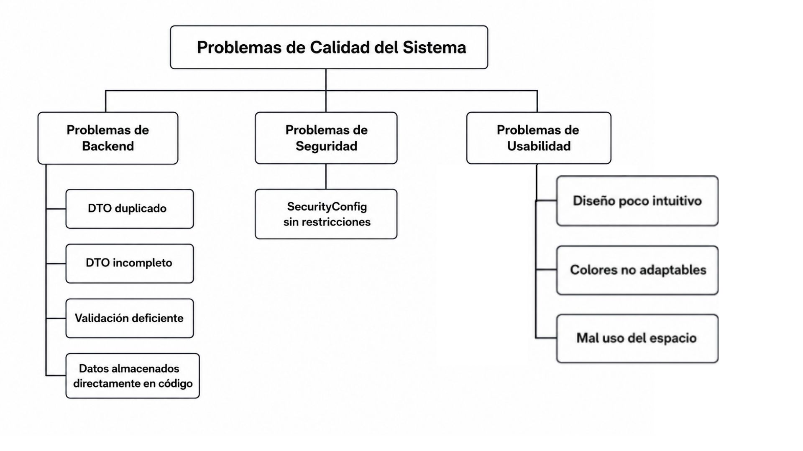

**Los errores que hemos encontrado en el backend son:**

- El archivo MetricResponseDTO.java estaba duplicado en la carpeta repository.
- En los endpoints de metrics/ se devolvía valores aunque el valor dado al endpoint no esté enlistado en el código, mostrando una mala validación de entrada.
- En SecurityConfig acepta todas las peticiones que recibe sin restricción, sirviendo más de adorno que como real seguridad.
- En DeveloperMetricRepository.java se encuentran los datos que deberían estar ocultos y guardados en una base de datos.
- MetricResquestDTO.java tiene un seteo muy pobre, hacen falta getters, setters, etc.

**También el codigo tenía varias areas de mejora:**

  -Por ejemplo el diseño era muy poco intuitivo
  -También como tal el lo colores estaban predefinidos por lo que si se utilizaba el tema oscuro, los colores de la interfaz no cambiaban
  -Mucho espacio se desperdiciaba en las graficas lo cual era información no tan relevante o que se podría distribuir mejor en la interfaz

